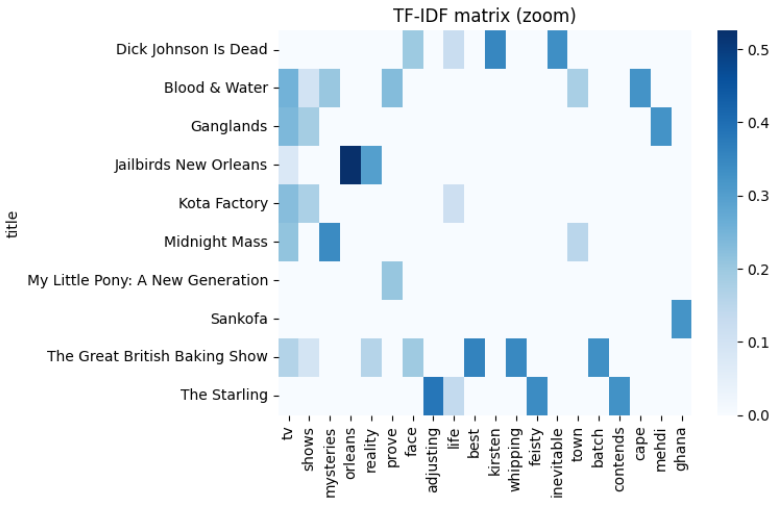
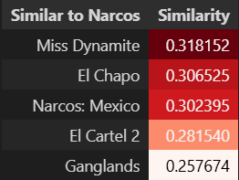
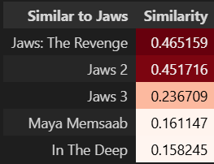
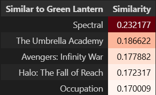

# 🎬 Netflix Content Recommendation Engine

This project implements a content-based recommendation system using the Netflix titles dataset. It leverages **Natural Language Processing (NLP)** and **Cosine Similarity** to suggest movies and TV shows based on their thematic metadata.

## 📊 Project Overview
The engine analyzes over 8,800 titles to provide relevant suggestions by transforming text descriptions and categories into mathematical vectors. By measuring the distance between these vectors, the system identifies titles with the highest thematic overlap.

## 🛠️ Tech Stack
* **Data Manipulation**: Pandas, NumPy.
* **Machine Learning**: Scikit-Learn (`TfidfVectorizer`, `cosine_similarity`).
* **Visualization**: Seaborn, Matplotlib.

## ⚙️ Technical Workflow

### 1. Data Cleaning and Feature Selection
* The dataset is loaded from `netflix_titles.csv`.
* Null values are handled using `dropna()` to ensure data integrity.
* The model focuses on the `description` and `listed_in` (genre) columns.

### 2. Feature Engineering: The "Soup"
* A custom function, `create_soup`, concatenates the description and genres into a single string for each entry.
* All text is normalized to lowercase to ensure consistency.


### 3. TF-IDF Vectorization
* The system uses `TfidfVectorizer` with English stop words to convert text into a numerical matrix.
* **Matrix Shape**: The resulting matrix contains 8,807 rows and 18,477 unique word columns.


### 4. Visual Analysis (Heatmap)
A heatmap was generated to visualize the most unique tokens across titles.




## 🚀 Recommendation Logic
The core of the engine is the `search_engine()` function. It calculates the **Cosine Similarity** between titles to find the closest matches.

```python
# Example of the final engine logic from the project
def search_engine():
    movie = input("Choose a movie and get similar ones: ")
    idx = df_indexes[movie]
    sim_scores = sorted(list(enumerate(cos_res[idx])), key=lambda x: x[1], reverse=True)
    top_matches = sim_scores[1:6]
    # ... formatting and returning results
```

### Final Results
The results are presented in a stylized DataFrame using a Red color gradient to highlight match strength.


<p align="center">
  
  
  
</p>

The recommendation engine provides high-quality results by identifying thematic links across a massive vocabulary of 18,477 unique terms. While similarity scores do not reach 100%, they represent significant overlap in a high-dimensional space.
+2

* **High Precision:** The engine identifies "Jaws" sequels with scores near 46.52%, indicating an exceptionally strong correlation for content-based filtering.

* **Thematic Accuracy:** Scores around 30% successfully capture niche sub-genres, such as linking "Narcos" to titles like "El Chapo" and "Miss Dynamite".

* **Statistical Context:** Because the model compares 8,807 titles across thousands of words, a 100% score is mathematically reserved for identical content.


* **Genre Alignment:** "Green Lantern" effectively suggests sci-fi titles like "Spectral" (23.22%) by analyzing shared metadata.

These percentages prove the model prioritizes unique keywords within the "soup" over generic vocabulary.

